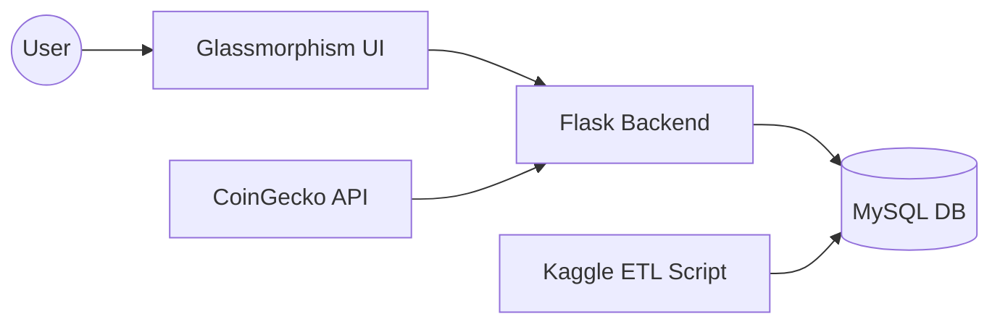
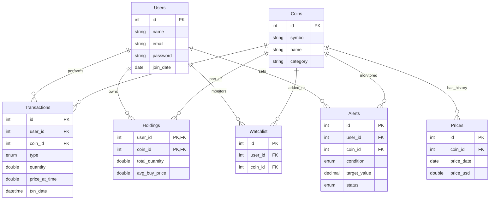

# 📊 PROJECT REPORT: CryptoTracker
**Real-Time Portfolio Management System**

---

## 1. Executive Summary
CryptoTracker is a comprehensive web-based application designed to provide users with real-time tracking and management of their cryptocurrency portfolios. Developed as part of a Database Management Systems (DBMS) course, the project emphasizes data integrity, automated ETL processes, and modern user interface design. The system integrates large-scale historical datasets from Kaggle with live market data from the CoinGecko API.

## 2. Project Objectives
- **Portfolio Management**: Allow users to log transactions (buy/sell) and monitor their holdings in real-time.
- **Data Integrity**: Implement MySQL Triggers to automatically calculate weighted average costs and update inventory.
- **Visual Excellence**: Utilize modern "Glassmorphism" design principles for a premium user experience.
- **Scalability**: Handle massive datasets (700MB+) through efficient indexing and automated background synchronization.

## 3. Technical Architecture

### Tech Stack
- **Backend**: Python (Flask) for routing and API management.
- **Database**: MySQL for relational data storage and business logic (Triggers/Views).
- **Frontend**: Vanilla ES6 JavaScript, HTML5, and Tailwind CSS.
- **Data Pipeline**: Python-driven ETL pipeline using Kaggle and CoinGecko APIs.

### System Diagram

## 4. Database Design

### Entity-Relationship Diagram

### Key Logic: Weighted Average Cost (WAC)
The system ensures that the `Holdings` table is always accurate without manual interference. This is achieved via a **MySQL Trigger**:
      - **WAC Calculation**: System automatically determines the weighted average cost for portfolio tracking.
- When a **Buy** transaction is inserted:
  - New Quantity = `Old Quantity + New Quantity`
  - New WAC = `((Old WAC * Old Quantity) + (New Price * New Quantity)) / New Quantity`
- When a **Sell** transaction is inserted:
  - New Quantity = `Old Quantity - Sold Quantity`

## 5. Key Features

### 💎 Liquid Glass UI
The interface features a minimalist, semi-transparent design with animated background "blobs." This ensures that data presentation is clear while maintaining a futuristic aesthetic.

### ⏱️ Real-Time Market Sync
Major assets (BTC, ETH, SOL) are synced directly with CoinGecko. For smaller tokens, the system uses the 700MB+ Kaggle dataset to provide historical context and dynamic simulations.

### 📈 Portfolio Analytics
The "Dashboard" provides instant insights into:
- **Total Portfolio Value**
- **Average Buy Price** for each asset
- **Real-time Profit/Loss (P&L)** calculations with visual indicators.

### 🔔 Smart Alert System
Users can set custom price thresholds (ABOVE or BELOW) for any asset. The system dynamically monitors these conditions and highlights triggered alerts with a high-visibility "Liquid Red" glow on the dashboard.

### 🌍 Dual-Timezone Logging
To cater to global analysis, the system displays transaction timestamps in both **Bangladesh Standard Time (BDT)** and **US Eastern Time (EST/EDT)**. This ensures that users can correlate market movements across different time zones instantly.

## 6. Setup & Deployment

### Local Environment
1. Install dependencies: `pip install -r requirements.txt`
2. Initialize Database: `python seed_data.py`
3. Run App: `python app.py`

### Cloud Deployment
The project is optimized for deployment on **Railway.app**, leveraging integrated MySQL services and environment variable configuration for secure database connections.

## 7. Conclusion & Future Work
CryptoTracker successfully demonstrates the application of advanced DBMS concepts in a modern fintech context. Future versions will include:
- Advanced charting (Candlestick charts).
- Multi-currency support (EUR, BDT, etc.).
- Automated notifications (Email/SMS Integration).

---
**Report Generated on:** January 30, 2026
**Created by:** `meetmehedi/CryptoTracker`
