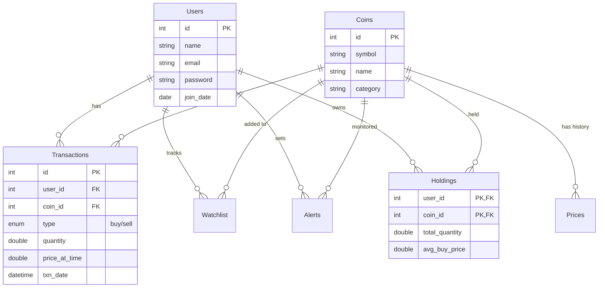

# 🎓 Lab Preparation: SQL Query Guide

This guide will help you understand, explain, and modify the database queries in your CryptoTracker app.

## 📊 1. Database Schema
Here is how your data is organized and how tables connect:



---

## 🔍 2. Core Queries Explained

### A. Fetching Portfolio (Holdings)
**Location:** `app.py` -> `get_holdings()`
```sql
SELECT c.symbol, c.name, h.total_quantity,
       (SELECT p.price_usd FROM Prices p 
        WHERE p.coin_id = c.id 
        ORDER BY p.price_date DESC, p.id DESC LIMIT 1) as current_price,
       h.avg_buy_price
FROM Holdings h
JOIN Coins c ON h.coin_id = c.id
WHERE h.user_id = %s
```
*   **Purpose:** Shows which coins a user owns.
*   **The Subquery:** The part in `(...)` finds the **latest price** for each coin by looking at the `Prices` table and taking the most recent entry.
*   **The Join:** Connects `Holdings` and `Coins` so we can see the "Symbol" (like BTC-USD) instead of just an ID (like 1).

### B. Latest Transactions
**Location:** `app.py` -> `get_transactions()`
```sql
SELECT t.type, t.quantity, t.price_at_time, t.txn_date, c.symbol, c.name
FROM Transactions t
JOIN Coins c ON t.coin_id = c.id
WHERE t.user_id = %s
ORDER BY t.txn_date DESC, t.id DESC
LIMIT 10
```
*   **Purpose:** Lists the 10 most recent buys/sells.
*   **Sorting:** `ORDER BY t.txn_date DESC` ensures the newest ones are at the top.

---

## 🛠️ 3. "How-To" Modify (Lab Practice)

Your professor might ask you to change these. Here’s how:

### ❓ "Show only 'Buy' transactions"
Change the `WHERE` clause:
```diff
- WHERE t.user_id = %s
+ WHERE t.user_id = %s AND t.type = 'buy'
```

### ❓ "Sort portfolio by quantity (highest first)"
Add an `ORDER BY` at the end of the holdings query:
```sql
... WHERE h.user_id = %s
ORDER BY h.total_quantity DESC
```

### ❓ "Only show transactions from the last 7 days"
Use the `INTERVAL` keyword:
```sql
... WHERE t.user_id = %s AND t.txn_date > NOW() - INTERVAL 7 DAY
```

### ❓ "Calculate total value of portfolio"
You can do this in SQL by multiplying `quantity * current_price`:
```sql
SELECT (h.total_quantity * (SELECT ...)) as total_value FROM ...
```

---

## ⚡ 4. The "Magic" Trigger
The `Holdings` table is updated **automatically** whenever you insert into `Transactions`.
**Logic:**
1.  If **Buy**: Add quantity, calculate new Average Buy Price.
2.  If **Sell**: Subtract quantity.

> [!TIP]
> If the prof asks "How do you calculate profit?", tell them:
> `Profit = (Current Price - Average Buy Price) * Total Quantity`.

---

## 🚀 Lab Strategy
1.  **Read the SQL:** Look for `cursor.execute("...")` in `app.py`.
2.  **Test Queries:** Use a tool like MySQL Workbench or just change the code and refresh the page.
3.  **Explain the JOIN:** "We use a JOIN because the name of the coin is in the `Coins` table, but the amount owned is in the `Holdings` table."
